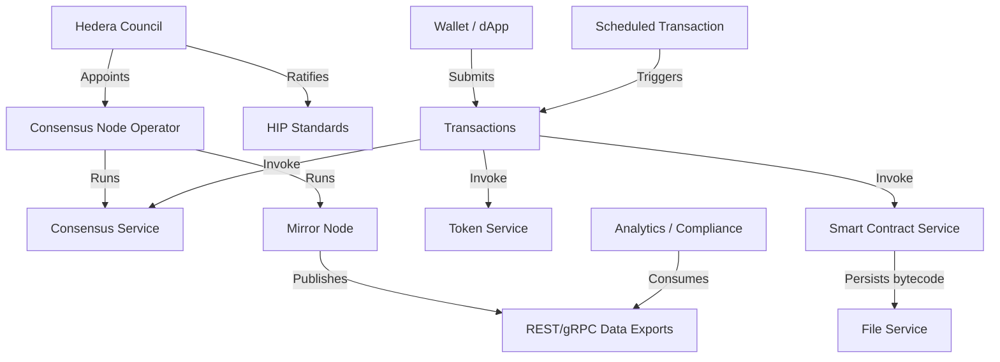
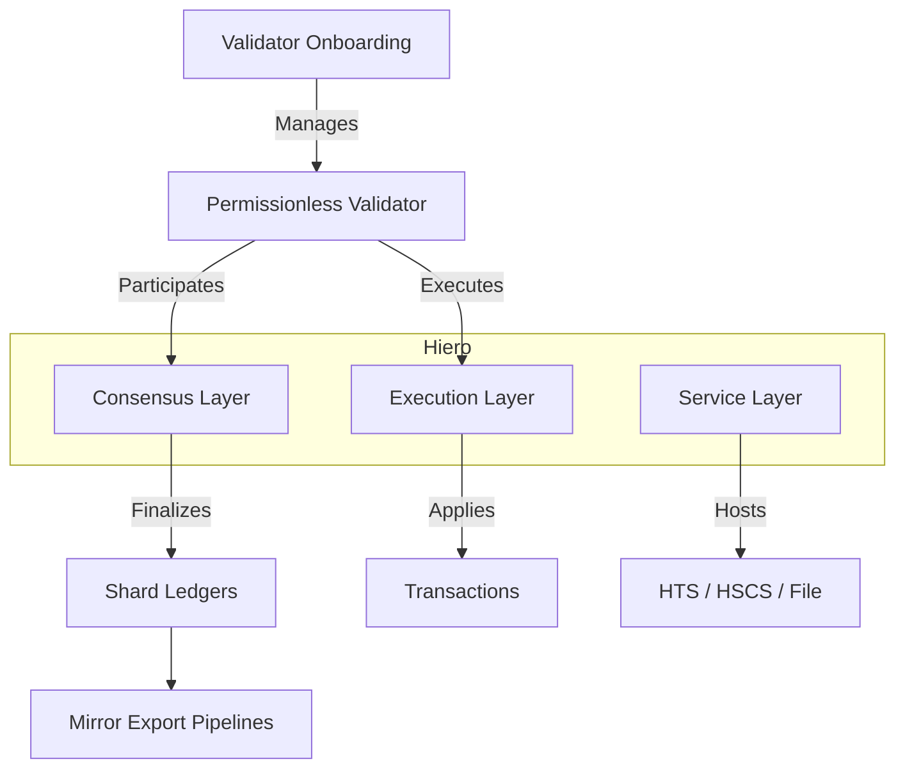

# Hedera & Hiero Context Maps (Phase 1 Draft)

These draft context diagrams capture how major actors, services, and artefacts interact across the Hedera network and forthcoming Hiero architecture.  They will evolve alongside formal ontology modelling and visual assets (e.g., draw.io, Excalidraw) in subsequent iterations.

## Actor-to-service relationships

**Observations**

* Wallets and dApps interact with multiple services through the same transaction pipeline; modelling a shared `hedera:Transaction` backbone is essential.
* The council influences both governance artefacts (HIPs) and operational actors (node operators), reinforcing the need for provenance links between policy and implementation.
* Mirror nodes act as the bridge between on-ledger events and off-ledger analytics, warranting DCAT/PROV alignments.

## Hiero modular layering

**Observations**

* Hiero introduces explicit layering that separates consensus from execution; ontology modules should encode these as subclasses of `hedera:Service` with dependencies.
* Permissionless validators participate in both consensus and execution flows, requiring role modelling that extends existing node operator concepts.
* Shard-specific ledgers will influence how mirror exports and analytics partition data; competency questions should account for shard context.

## Data lifecycle overview

```mermaid
graph LR
  UserEvent[User / dApp Action]
  UserEvent --> TransactionSubmission[Transaction Submission]
  TransactionSubmission --> ConsensusOrdering[Consensus Ordering]
  ConsensusOrdering --> ExecutionPhase[Service Execution]
  ExecutionPhase --> RecordFiles[Record & Balance Files]
  RecordFiles --> MirrorAPIs[Mirror APIs]
  MirrorAPIs --> AnalyticsPipelines[Analytics & Compliance Pipelines]
  AnalyticsPipelines --> Feedback[Governance Feedback / HIP Proposals]
  Feedback --> Council
```

**Observations**

* Every lifecycle stage has observable artefacts (transactions, record files, mirror API payloads) suitable for provenance modelling.
* Feedback loops from analytics/compliance back to governance suggest competency questions around policy effectiveness and anomaly detection.
* Staking reward calculations intersect with both execution outputs and governance oversight—capture this interplay in later diagrams.

## Next steps

1. Validate these draft diagrams with subject matter experts and replace with high-fidelity visuals once relationships stabilise.
2. Align Mermaid elements with forthcoming ontology class names to keep documentation and OWL modules in sync.
3. Extend the diagrams to include scheduled transactions, staking reward cycles, and cross-shard messaging once Hiero specifications mature.
